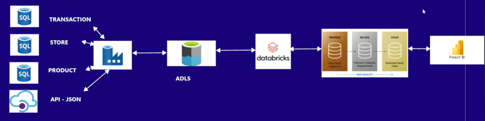

# Retail Multi-Source Data Pipeline (Data Engineering)

## Overview
This project is an end-to-end retail data engineering pipeline built using Azure, Databricks, and Power BI. It brings data from multiple sources into a single analytics pipeline and transforms it into business-ready insights.

## Business Requirement
The goal of this project is to build a retail data pipeline for multiple retail clients. Data comes from different sources and needs to be brought into a data lake, transformed, and used for reporting.

## Data Sources
- Transaction data from Azure SQL Database
- Store data from Azure SQL Database
- Product data from Azure SQL Database
- Customer data from API in JSON format

## Architecture

The pipeline follows this flow:

Azure SQL DB + API/JSON → Azure Data Lake Storage (ADLS) → Databricks → Bronze / Silver / Gold Layers → Power BI

## Tools and Technologies
- Azure SQL Database
- Azure Data Lake Storage (ADLS)
- Azure Databricks
- PySpark
- Delta Lake
- Power BI

## Pipeline Flow

### 1. Data Ingestion
Data is collected from Azure SQL Database and JSON/API sources and loaded into Azure Data Lake Storage.

### 2. Bronze Layer
The Bronze layer stores raw data exactly as it comes from the source systems.

### 3. Silver Layer
The Silver layer contains cleaned and transformed data. In this layer:
- data types are corrected
- duplicates are removed
- transaction, customer, product, and store data are joined
- derived columns such as total sales amount are created

### 4. Gold Layer
The Gold layer contains business-level aggregated data for reporting and analytics. It includes:
- total quantity sold
- total sales amount
- number of transactions
- average transaction value

### 5. Reporting
The final Gold layer is connected to Power BI to create dashboards and generate retail business insights.

## Key Transformations
- Type casting
- Duplicate removal
- Joining multiple datasets
- Creating derived columns
- Aggregating business metrics

## Project Files
- `retail_pipeline.py` - Databricks notebook logic
- `init_retail_tables.sql` - SQL script for source tables
- `customers.json` - customer source data
- `gold_retail.csv` - final output sample
- `Retail_Dashboard.pbix` - Power BI dashboard
- `architecture.png` - project architecture diagram

## Outcome
This project demonstrates how to build a simple end-to-end retail data pipeline using Azure services, Databricks, and Power BI by processing raw multi-source data into a final reporting layer.
